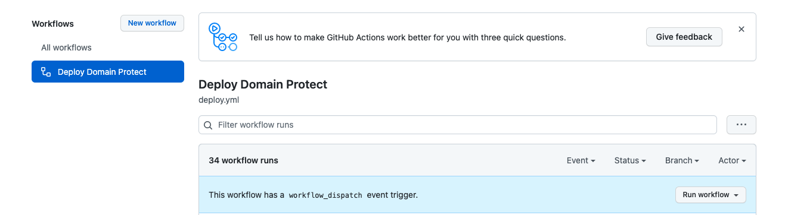
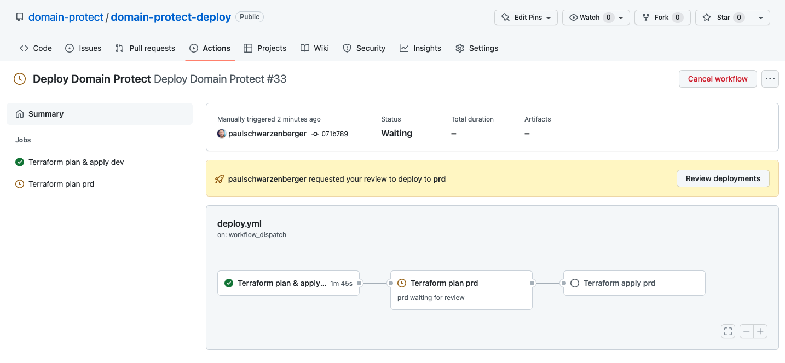
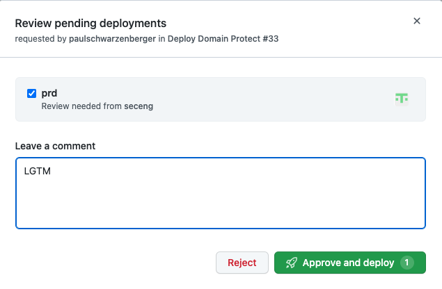
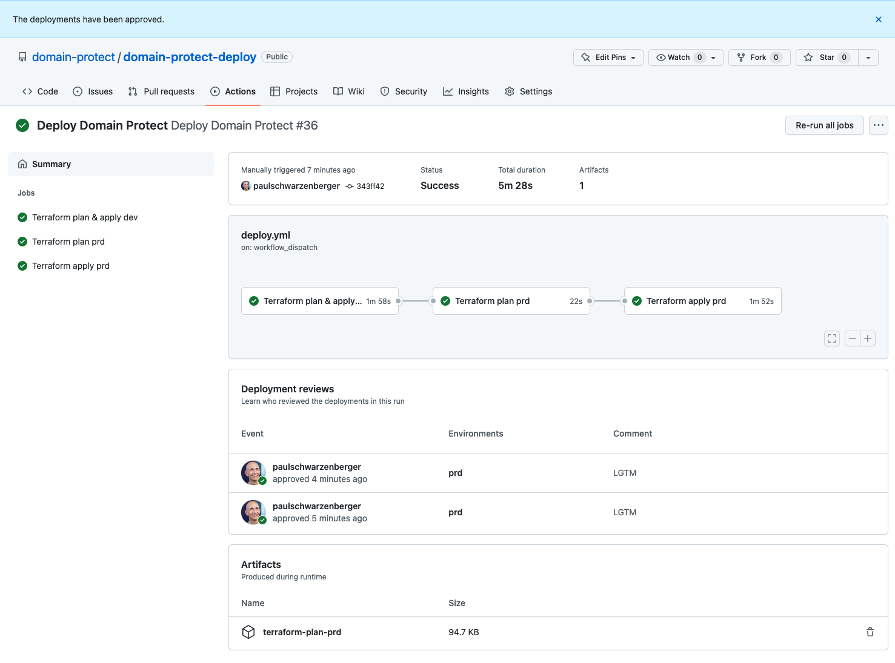

# Deploy
* In `YOUR_GITHUB_ORG/domain-protect-deploy` select Actions
* Workflow triggers automatically on `git push`
* To trigger manually, select the Deploy Domain Protect workflow

* Press Run workflow
* Choose the main branch

* When prompted, press Review deployments
 
* Approve to proceed to production
* Review Terraform plan and approve again to apply in production

* Terraform plan is available as an artifact for download
