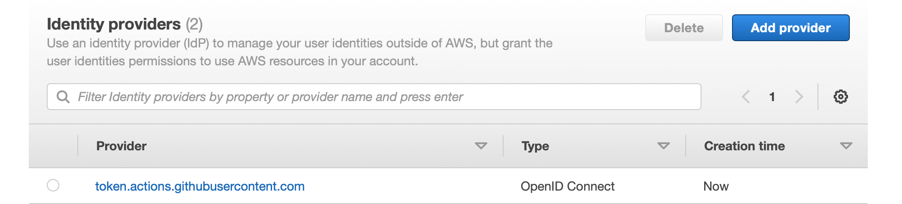
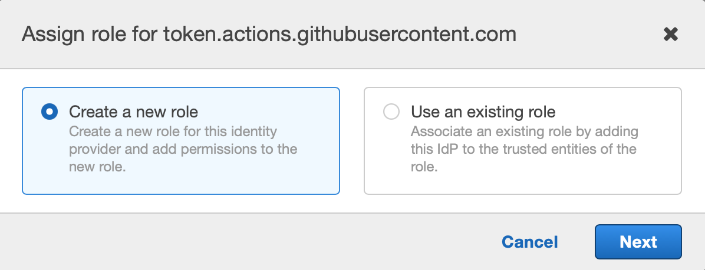
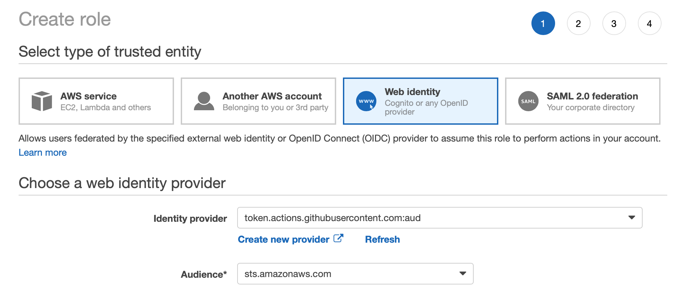
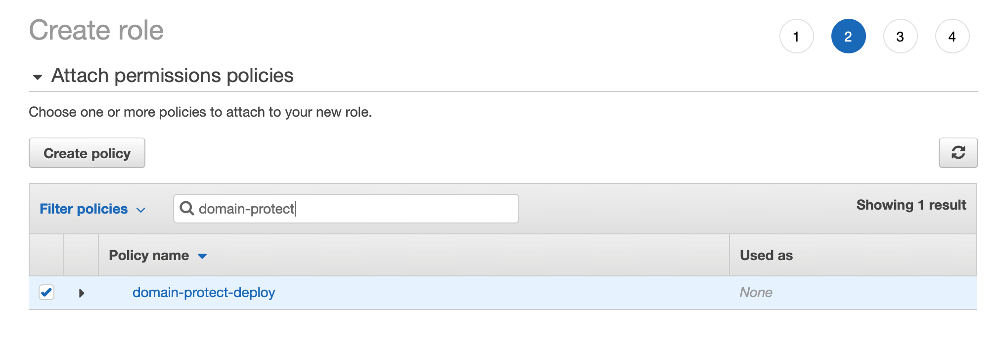
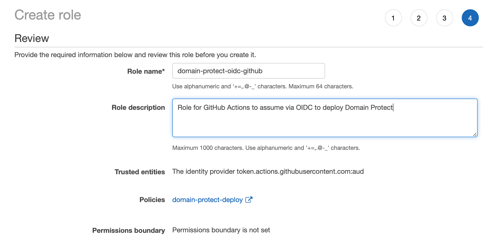
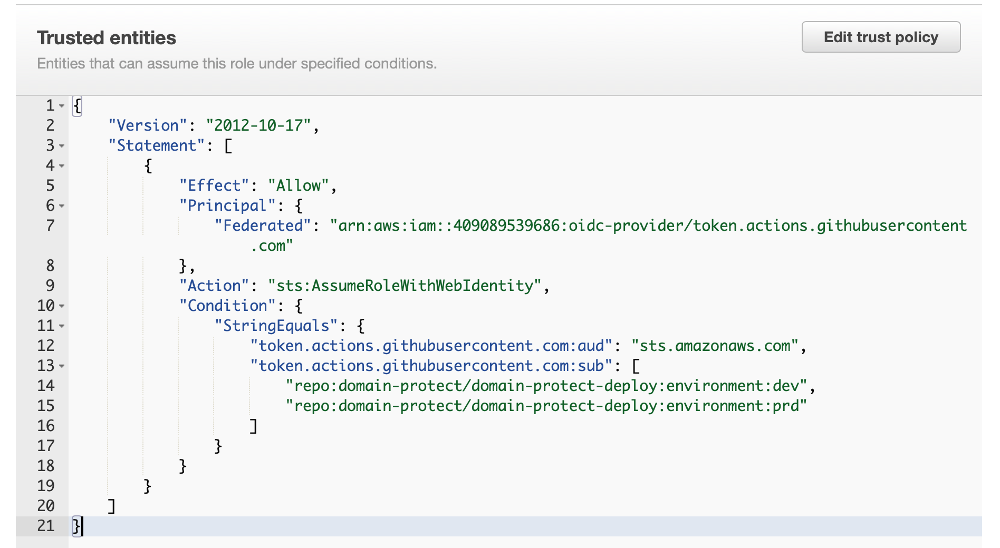

## OpenID Connect configuration in AWS
* log in to your security tooling AWS account and go to IAM
* select Identity providers

* add an Identity Provider
* choose OpenID Connect
* for the Provider URL enter `token.actions.githubusercontent.com`
* press Get thumbprint
* for Audience enter sts.amazonaws.com
* press Add Provider

* select the newly added Identity Provider
* press Assign Role

* select Create a new role
* press Next

* for Audience, choose `sts.amazonaws.com` from the drop-down
* press Next: Permissions

* select `domain-protect-deploy` policy
* press Next: Tags
* press Next: Review

* name the new role `domain-protect-oidc-github`
* enter an appropriate description
* press Create role
* edit the Trust Policy - THIS MUST BE DONE IMMEDIATELY - OTHERWISE ANYONE IN THE WORLD CAN ASSUME THE ROLE

* enter the second statement under `StringEquals`:
```
"Condition": {
                "StringEquals": {
                    "token.actions.githubusercontent.com:aud": "sts.amazonaws.com",
                    "token.actions.githubusercontent.com:sub": [
                        "repo:YOUR_GITHUB_ORG/domain-protect-deploy:ref:refs/heads/main"
                    ]
                }
            }
```