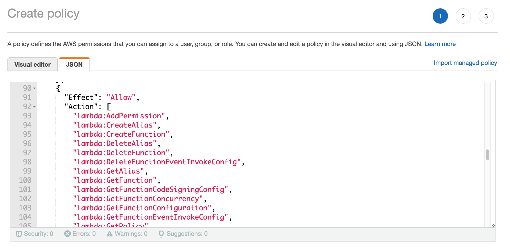

## Create Deploy Policy
* log in to security tooling AWS account
* select IAM, policies, create policy
* choose JSON
* copy and paste the [Domain Protect deploy policy](https://github.com/domain-protect/domain-protect/blob/main/aws-iam-policies/domain-protect-deploy.json)

* replace `TERRAFORM_STATE_BUCKET` with your Terraform state S3 bucket name
* replace `TERRAFORM_STATE_KEY` with `domain-protect`
* replace `SECURITY_AWS_ACCOUNT_ID` with your AccountID
* ensure there are no errors or warnings
* press Next: Tags
* press Next: Review

* name policy `domain-protect-deploy`
* give an appropriate description
* press Create Policy
