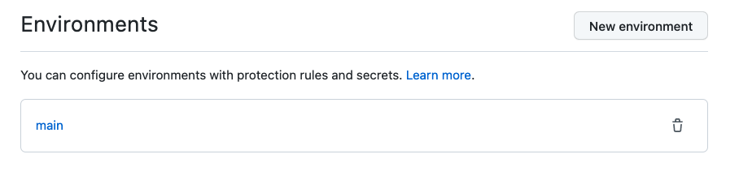
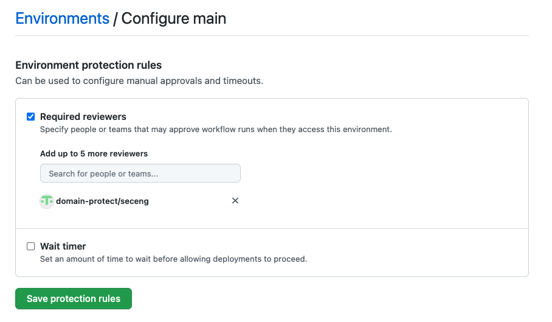
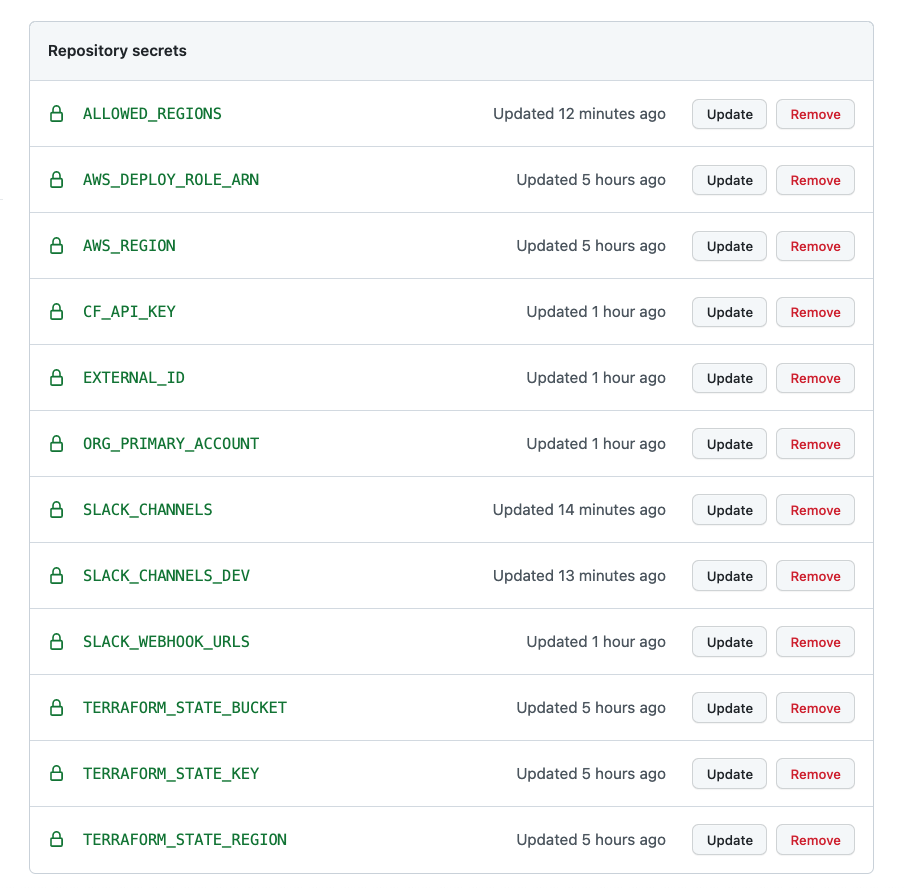

## Create repo in your own GitHub Organisation
* create a private or internal empty repository `domain-protect-deploy` in your organisation
```
git clone https://github.com/domain-protect/domain-protect-deploy
git remote rename origin upstream
git remote add origin https://YOUR_GITHUB_ORG/domain-protect-deploy
git push origin main
```

## Set up GitHub Actions environment
* a GitHub Actions environment is needed for manual approval steps
* within the GitHub repository web console, select Settings, Code and automation, Environments
* create a new environment `main`

* select the newly created environment
* configure Environment protect rules
* select Required reviewers
* enter an appropriate team

* save protection rules

## Enter secrets
* at Settings, Security, Secrets, Actions, enter Repository secrets:

| ENVIRONMENT VARIABLE            | EXAMPLE VALUE / COMMENT                          |
| ------------------------------- | -------------------------------------------------|
| AWS_DEPLOY_ROLE_ARN             | arn:aws:iam::123456789012:role/domain-protect-oidc-github        |
| AWS_REGION                      | eu-west-1    |
| TERRAFORM_STATE_BUCKET          | tfstate48903                                     |
| TERRAFORM_STATE_KEY             | domain-protect                                   |
| TERRAFORM_STATE_REGION          | us-east-1                                        |  
| TF_VAR_org_primary_account      | 012345678901                                     | 
| TF_VAR_security_audit_role_name | not needed if "domain-protect-audit" used        |
| TF_VAR_external_id              | only required if External ID is configured       |
| TF_VAR_slack_channels           | ["security-alerts"]                              |
| TF_VAR_slack_channels_dev       | ["security-alerts-dev"]                          |
| TF_VAR_slack_webhook_urls       | ["https://hooks.slack.com/services/XXX/XXX/XXX"] | 



* enter additional environment variables to turn on optional features
* Terraform variables should be prefixed by `TF_VAR_`
* this can be done at any time